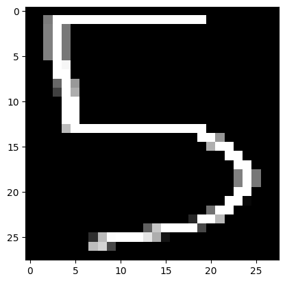
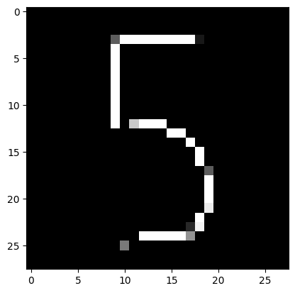
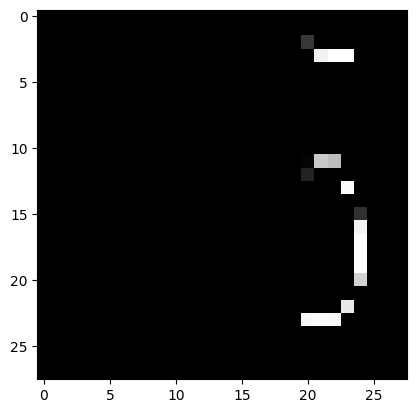

### **Task Title**
*Task 02 CustomDigit*

### **1. Objective**
To evaluate the model's ability to generalize on custom handwritten data and analyze how preprocessing variations (cropping, margins, aspect ratio) impact classification accuracy and distribution alignment.

### **2. Code Used**
```
# Processing three variations of a handwritten "5"
images = ["image.png", "image_2.png", "image_3.png"]

for img_path in images:
    # 1. Load as grayscale
    img = cv2.imread(img_path, cv2.IMREAD_GRAYSCALE)
    
    # 2. Resize to 28x28 and Normalize (0-1)
    img = cv2.resize(img, (28, 28)) / 255.0
    
    # 3. Predict
    pred = model.predict(img.reshape(1, 28, 28))
    print(f"File: {img_path} | Prediction: {np.argmax(pred)}")
    
    # 4. Visualize
    plt.imshow(img, cmap="gray")
    plt.show()
```

### **3. Results**
```
Try 1 (Tight non-square crop): Predicted 3 (Incorrect)

Try 2 (Square crop with margins): Predicted 5 (Correct)

Try 3 (Large left margin): Predicted 2 (Incorrect)
```
**First try**


**Second try**


**Third try**



### **4. Short Analysis**
The model only succeeded when the input matched the training data's structure.

Distribution Shift: The training data (MNIST) consists of digits centered within a square frame with padding. The first and third inputs deviated from this distribution, causing the model to misinterpret the inputs.

Aspect Ratio Distortion: In Try 1, resizing a non-square crop to 28x28 stretched the digit, distorting the geometric features (curves and lines) the model relies on, leading it to confuse the "5" for a "3".

Representation Learning: Neural networks often learn spatial features. In Try 3, the large margin shifted the "5" to the right. Since the model lacks translation invariance (it wasn't trained with sufficient augmentation), it failed to recognize the features in this unexpected location.

Preprocessing Alignment: The success of Try 2 demonstrates that strict adherence to the training set's preprocessing pipeline (centering and aspect ratio preservation) is critical for inference accuracy.

### **5. Key Takeaway**
Neural networks are sensitive to spatial alignment and scaling; input data during inference must statistically and geometrically resemble the training data to avoid classification errors.