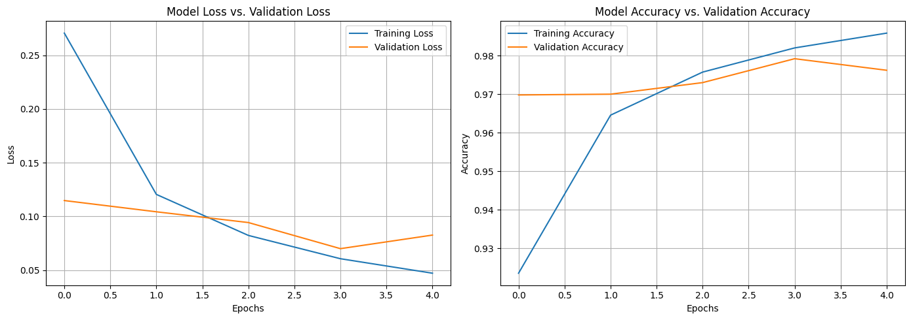
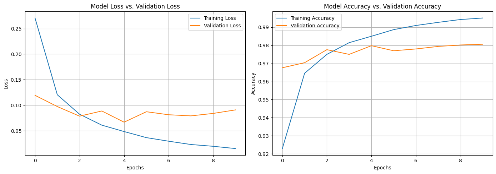
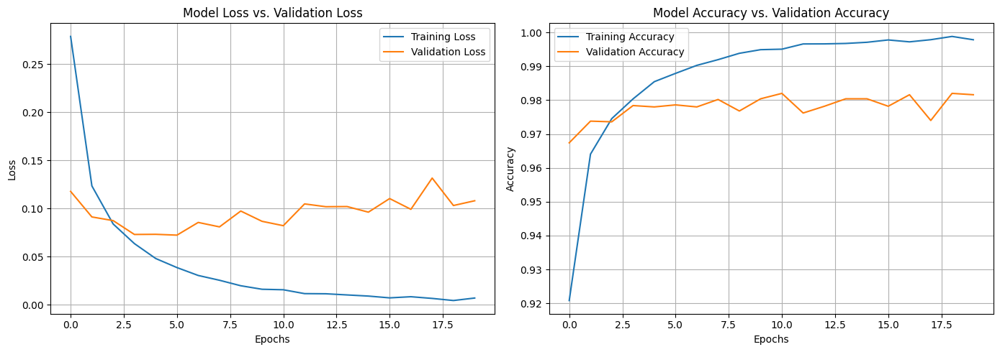

### **Task Title**
*Task 03 Epochs*

### **1. Objective**
To investigate the impact of training duration (5, 10, and 20 epochs) on model convergence and generalization, specifically identifying the point where the model stops learning useful features and begins memorizing the training data (overfitting).

### **2. Code Used**
```
epochs_list = [5, 10, 20]

for e in epochs_list:
    model = keras.Sequential([
        keras.layers.Flatten(input_shape=(28, 28)),
        keras.layers.Dense(128, activation="relu"),
        keras.layers.Dense(10, activation="softmax")
    ])
    
    model.compile(optimizer="adam", 
                  loss="sparse_categorical_crossentropy", 
                  metrics=["accuracy"])
    
    history = model.fit(x_tr, y_tr, epochs=e, validation_data=(x_val, y_val))
    
    # Plotting code (omitted for brevity)
```
### **3. Results**
| Epochs | Final Train Loss | Final Val Loss | Final Train Acc | Final Val Acc | Observation |
| :--- | :--- | :--- | :--- | :--- | :--- |
| **5** | 0.0436 | 0.0827 | 98.74% | 97.62% | **Optimal Fit:** Low variance between train/val. |
| **10** | 0.0128 | 0.0908 | 99.64% | 98.06% | **Divergence Starts:** Val loss stops improving around Epoch 5. |
| **20** | 0.0049 | 0.1080 | 99.85% | 98.16% | **Overfitting:** Train loss nears 0, while Val loss increases. |

**5 epochs Loss Curve**


**10 epochs Loss Curve**


**20 epochs Loss Curve**


### **4. Short Analysis**
The learning curves reveal distinct behaviors as training progresses:

Optimizer Speed: The Adam optimizer demonstrated rapid convergence. By just the 2nd epoch in all runs, accuracy jumped to ~96%, showing Adam's efficiency in navigating the loss landscape quickly using adaptive learning rates.

Overfitting Signs (20 Epochs): In the 20-epoch run, a clear generalization gap emerged. While training loss continued to drop (memorizing specific noise in the training set), the validation loss began to creep upward after epoch 6 (from ~0.07 to ~0.10). This indicates the model was no longer learning general patterns but fitting to the training data's idiosyncrasies.

Stability: The 5-epoch run was the most stable, maintaining a tight correlation between training and validation metrics.

### **5. Key Takeaway**
Training beyond the point of validation loss convergence (diminishing returns) leads to overfitting; monitoring validation loss is more critical than training accuracy for determining the optimal stop point.