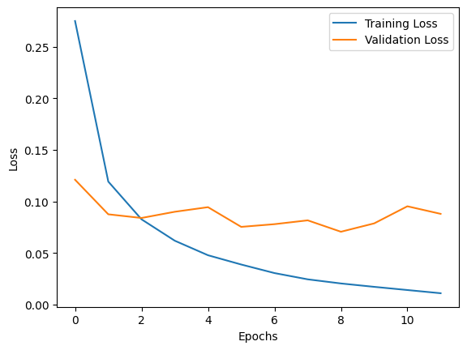
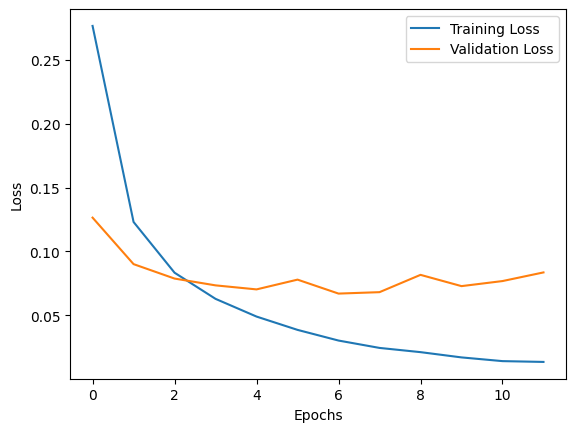

### **Task Title**
*Task 04 EarlyStopping*

### **1. Objective**
To analyze how EarlyStopping prevents overfitting by monitoring validation loss and effectively halting training when the model stops generalizing, testing sensitivities to the patience parameter.
### **2. Code Used**
```
# Defined callback with patience=3 and then patience=5

model_with_callBack_patience_5 = keras.Sequential([
    keras.layers.Flatten(input_shape=(28, 28)),
    keras.layers.Dense(128, activation="relu"),
    keras.layers.Dense(10, activation="softmax")
])

model_with_callBack_patience_5.compile(optimizer="adam",
              loss="sparse_categorical_crossentropy",
              metrics=["accuracy"])

callbacks = [
    keras.callbacks.EarlyStopping(patience=5, restore_best_weights=True)
]

history = model_with_callBack_patience_5.fit(
    x_tr, y_tr,
    epochs=20,
    batch_size=32,
    validation_data=(x_val, y_val),
    callbacks=callbacks
)

```

### **3. Results**
**Run 1 (Patience = 3):**

Stopped at: Epoch 12

Best Result: Epoch 9 (Val Loss: 0.0706)

Behavior: The model waited 3 epochs (10, 11, 12) seeing no improvement over 0.0706 before stopping.

**Run 2 (Patience = 5):**

Stopped at: Epoch 12

Best Result: Epoch 7 (Val Loss: 0.0669)

Behavior: The model ignored the slight volatility after Epoch 7 and continued training, but since val loss never beat 0.0669 for 5 consecutive epochs, it terminated.

**patience=3 Loss Curve**


**patience=5 Loss Curve**



### **4. Short Analysis**
Why Validation Loss Controls Decision: Validation loss is the proxy for generalization. If training loss decreases while validation loss increases (or stagnates), the model is memorizing noise (overfitting) rather than learning patterns.

Impact of Increased Patience (3 vs 5): Increasing patience allows the model to tolerate temporary fluctuations in the loss curve (common with stochastic training). However, in this case, patience=5 resulted in more overfitting (continuing until Epoch 12 despite the best model occurring at Epoch 7), though restore_best_weights=True mitigated the damage by reverting the weights.

Optimizer Influence (Adam vs. SGD):

Adam: Often converges rapidly but can produce "jittery" loss curves, potentially triggering EarlyStopping prematurely if patience is too low.

SGD: typically converges more slowly and smoothly; it might require a larger patience or more epochs to trigger the stop condition compared to Adam.

Indirect Regularization: EarlyStopping acts as a "temporal regularizer." By limiting the number of update steps based on validation performance, it prevents the weights from being optimized to the point where they fit the training data's noise.

### **5. Key Takeaway**
EarlyStopping is an essential efficiency tool that saves computational resources and prevents overfitting, but patience must be tuned to balance between premature stopping and wasting cycles on overfitted epochs.