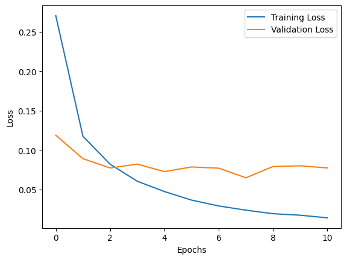
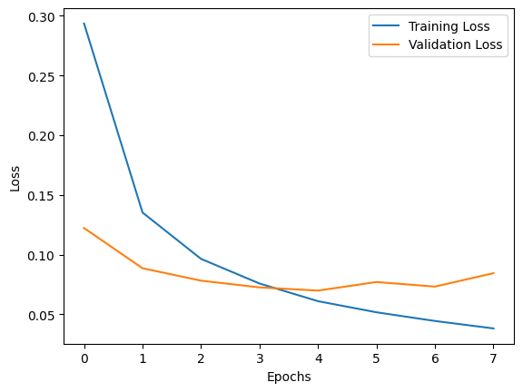
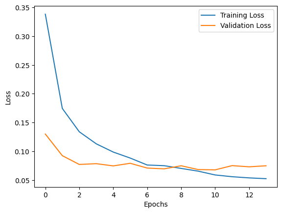

### **Task Title**
*Task 05 Dropout*

### **1. Objective**
To evaluate the regularization effect of Dropout by comparing three configurations (0%, 10%, 30%), analyzing how randomly deactivating neurons impacts overfitting, training convergence, and the generalization gap.

### **2. Code Used**
```
# Configuration: Dropout = 0.3
model_with_dropout_2 = keras.Sequential([
    keras.layers.Flatten(input_shape=(28, 28)),
    keras.layers.Dense(128, activation="relu"),
    keras.layers.Dropout(0.3),   # prevent overfitting
    keras.layers.Dense(10, activation="softmax")
])

model_with_dropout_2.compile(optimizer="adam",
              loss="sparse_categorical_crossentropy",
              metrics=["accuracy"])

callbacks = [
    keras.callbacks.EarlyStopping(patience=3, restore_best_weights=True)
]

history = model_with_dropout_2.fit(
    x_tr, y_tr,
    epochs=20,
    batch_size=32,
    validation_data=(x_val, y_val),
    callbacks=callbacks
)
# (Training loop repeated for 0.0, 0.1, and 0.3)
```

### **3. Results**
| Configuration | Best Val Loss | Generalization Gap (Train vs Val) | Convergence Speed |
| :--- | :--- | :--- | :--- |
| **No Dropout** | 0.0726 (Ep 5) | **High:** Large gap (~0.04) suggests mild overfitting. | **Fast:** Rapid drop in training loss. |
| **Dropout 0.1** | 0.0699 (Ep 5) | **Moderate:** Gap narrowed; Val loss improved slightly. | **Medium:** Similar speed to baseline. |
| **Dropout 0.3** | 0.0679 (Ep 11) | **Low:** Very tight gap (<0.01); robust generalization. | **Slow:** Required more epochs (14) to converge. |

**No DropOut Loss Curve**


**10% DropOut Loss Curve**


**30% DropOut Loss Curve**



### **4. Short Analysis**
The results clearly demonstrate the trade-off between training speed and robustness:

Overfitting vs. Generalization: The model with No Dropout learned the fastest but showed the largest gap between training and validation loss, indicating it was starting to rely on specific noise patterns.

Robustness (Dropout 0.3): The model with 30% dropout achieved the lowest validation loss (0.0679). Although it took longer to train (14 epochs vs 11), the final model is more reliable on unseen data.

Mechanism of Action (Co-adaptation): Dropout forces the network to learn redundant representations. By randomly silencing neurons during training, no single neuron can rely solely on the output of a specific neighbor (preventing "co-adaptation"). This forces the network to distribute features across the entire layer, resulting in a more resilient decision boundary.

### **5. Key Takeaway**
Dropout effectively acts as an ensemble method within a single model, significantly reducing the generalization gap at the cost of slightly slower training convergence.