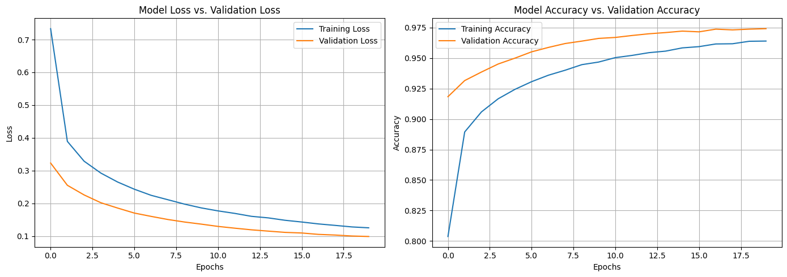
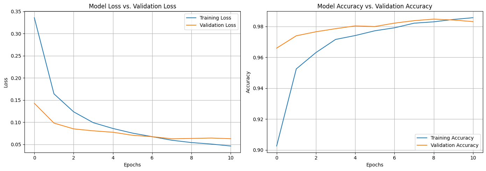
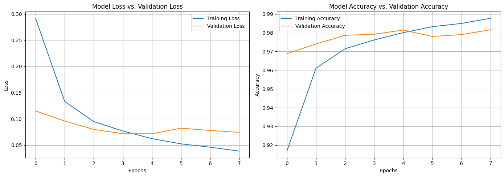

### **Task Title**
*Task 07 Optimizers*

### **1. Objective**
To compare the convergence speed and stability of four different optimization algorithms (Standard SGD, SGD with Momentum, Adam, and AdamW) to understand how they navigate the loss landscape differently.
### **2. Code Used**
```
SGD_1 = SGD(
    learning_rate=0.01,
    momentum=0.0
)
SGD_2 = SGD(
    learning_rate=0.01,
    momentum=0.9
)
AdamW = AdamW(
    learning_rate=1e-3,
    weight_decay=1e-4
)

# Configuration: optimzer=sgd with 0.01 learning rate and the same concept for the rest of the optimizers
model_with_sgd_1 = keras.Sequential([
    keras.layers.Flatten(input_shape=(28, 28)),
    keras.layers.Dense(128, activation="relu"),
    keras.layers.Dropout(0.1),   # prevent overfitting
    keras.layers.Dense(10, activation="softmax")
])

model_with_sgd_1.compile(optimizer=SGD_1,
              loss="sparse_categorical_crossentropy",
              metrics=["accuracy"])

callbacks = [
    keras.callbacks.EarlyStopping(patience=3, restore_best_weights=True)
]

history = model_with_sgd_1.fit(
    x_tr, y_tr,
    epochs=20,
    batch_size=32,
    validation_data=(x_val, y_val),
    callbacks=callbacks
)

```

### **3. Results**

| Optimizer | Epochs to Stop | Best Val Loss | Best Val Accuracy | Behavior |
| :--- | :--- | :--- | :--- | :--- |
| **SGD** | 20 (Max) | 0.0988 | 97.42% | **Slow & Steady:** Constant improvement but slow convergence. |
| **SGD + Momentum** | 11 | 0.0628 | 98.38% | **Accelerated:** Converged much faster and reached lower loss than vanilla SGD. |
| **Adam** | 8 | 0.0716 | 98.14% | **Rapid Start:** Learned very quickly but plateaued early. |
| **AdamW** | 8 | 0.0697 | 98.20% | **Refined:** Similar to Adam but weight decay slightly improved loss. |


**sgd with 0.01 learning rate Loss Curve**


**sgd with momentum Loss Curve**


**adam Loss Curve**


**adamW Loss Curve**


### **4. Short Analysis**
The choice of optimizer drastically changed the training dynamics:

Vanilla SGD was the slowest because it uses a fixed learning rate for all parameters and lacks acceleration, struggling to navigate shallow ravines in the loss landscape.

SGD + Momentum performed exceptionally well. By adding a fraction of the previous update vector to the current one, momentum builds velocity in consistent directions, dampening oscillations and speeding up convergence.

Adam & AdamW showed the fastest initial learning (reaching >96% accuracy by Epoch 2). Adam adapts the learning rate for each parameter individually using estimates of the first and second moments of the gradients. However, AdamW (Adam with decoupled Weight Decay) provided a slightly better regularization effect, resulting in a marginally lower validation loss (0.069 vs 0.071) before early stopping.

### **5. Key Takeaway**
While Adam/AdamW offers the fastest "out-of-the-box" convergence, SGD with Momentum often achieves better long-term generalization (lower loss) if given enough epochs.